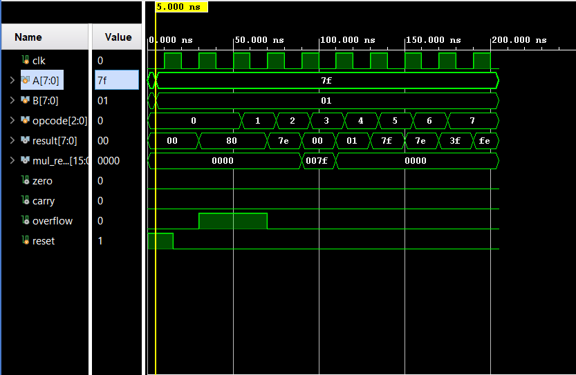
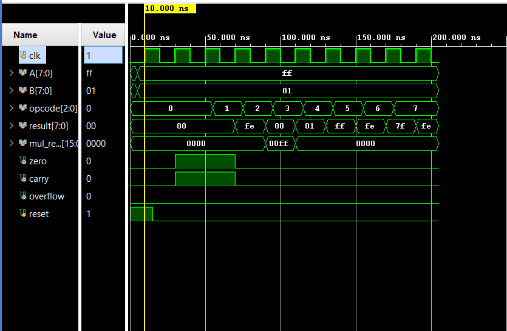
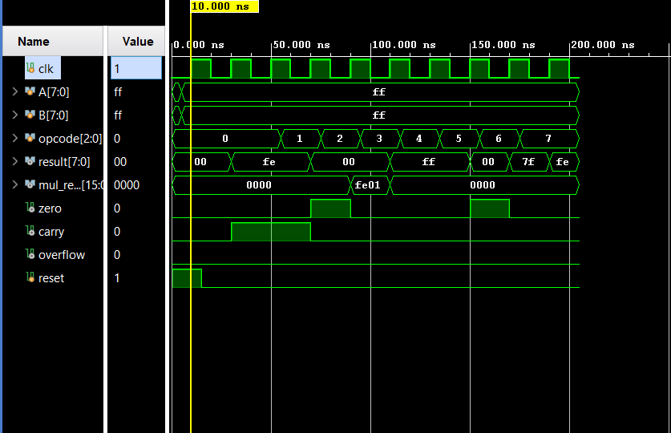

# 8-Bit Arithmetic Logic Unit (ALU) in Verilog

## Project Overview

This project implements an 8-bit synchronous Arithmetic Logic Unit (ALU) using Verilog HDL. The ALU performs arithmetic, logical, and shift operations based on a 3-bit opcode input. In addition to generating operation results, the ALU produces status flags such as Zero, Carry, and Overflow for arithmetic operations.

The design was functionally verified through simulation and synthesized using Xilinx Vivado 2025.2 targeting the XC7Z010CLG400-1 FPGA.

---

## Features

* 8-bit Arithmetic Operations

  * Addition
  * Subtraction
  * Multiplication

* Bitwise Logical Operations

  * AND
  * OR
  * XOR

* Shift Operations

  * Logical Left Shift
  * Logical Right Shift

* Status Flags

  * Zero Flag
  * Carry Flag
  * Overflow Flag

* Synchronous Design with Asynchronous Reset

---

## Module Interface

### Inputs

| Signal | Width | Description        |
| ------ | ----- | ------------------ |
| clk    | 1     | System clock       |
| reset  | 1     | Asynchronous reset |
| A      | 8     | First operand      |
| B      | 8     | Second operand     |
| opcode | 3     | Operation select   |

### Outputs

| Signal     | Width | Description                                 |
| ---------- | ----- | ------------------------------------------- |
| result     | 8     | ALU operation result                        |
| mul_result | 16    | Multiplication result                       |
| zero       | 1     | Indicates result equals zero                |
| carry      | 1     | Indicates unsigned overflow during addition |
| overflow   | 1     | Indicates signed arithmetic overflow        |

---

## ALU Operations

| Opcode | Operation | Description         |
| ------ | --------- | ------------------- |
| 000    | A + B     | Addition            |
| 001    | A - B     | Subtraction         |
| 010    | A × B     | Multiplication      |
| 011    | A & B     | Bitwise AND         |
| 100    | A | B     | Bitwise OR          |
| 101    | A ^ B     | Bitwise XOR         |
| 110    | A >> 1    | Logical Right Shift |
| 111    | A << 1    | Logical Left Shift  |

---

## Status Flags

### Carry Flag

The Carry flag is generated during addition and indicates unsigned overflow when the result exceeds the 8-bit range.

Example:

255 + 1 = 256

Result = 00
Carry = 1

---

### Overflow Flag

The Overflow flag indicates signed arithmetic overflow.

Addition Example:

127 + 1 = 128

Result = 10000000

Overflow = 1

Subtraction Example:

127 − (-1) = 128

Overflow = 1

---

### Zero Flag

The Zero flag is asserted whenever the result of an operation equals zero.

Examples:

* 5 − 5 = 0
* 255 + 1 = 0 (lower 8 bits)
* 255 XOR 255 = 0

---

## Simulation and Verification

A dedicated Verilog testbench was developed to verify all ALU functionalities.

### Verified Operations

* Addition
* Subtraction
* Multiplication
* Bitwise AND
* Bitwise OR
* Bitwise XOR
* Logical Left Shift
* Logical Right Shift

### Verified Flags

* Carry Flag Detection
* Overflow Flag Detection
* Zero Flag Detection

### Representative Test Cases

| Test Case   | Expected Behavior            |
| ----------- | ---------------------------- |
| 127 + 1     | Overflow = 1                 |
| 255 + 1     | Carry = 1, Zero = 1          |
| 5 - 5       | Zero = 1                     |
| 255 × 255   | Multiplication result = FE01 |
| 255 XOR 255 | Result = 00, Zero = 1        |

Simulation waveforms confirmed the correct functionality of all operations and status flags.
## Simulation Waveforms

### Test Case 1 – Addition Overflow Detection

**Inputs**
- A = 8'h7F
- B = 8'h01
- Opcode = 000 (Addition)

**Expected Result**
- Result = 8'h80
- Overflow = 1
- Carry = 0



---

### Test Case 2 – Addition Carry Detection

**Inputs**
- A = 8'hFF
- B = 8'h01
- Opcode = 000 (Addition)

**Expected Result**
- Result = 8'h00
- Carry = 1
- Zero = 1
- Overflow = 0



---

### Test Case 3 – ALU Functional Verification

This waveform verifies all supported ALU operations:

| Opcode | Operation |
|----------|-----------|
| 000 | Addition |
| 001 | Subtraction |
| 010 | Multiplication |
| 011 | AND |
| 100 | OR |
| 101 | XOR |
| 110 | Right Shift |
| 111 | Left Shift |



---

## Synthesis Results

Target FPGA: XC7Z010CLG400-1

Tool Used: Vivado 2025.2

### Resource Utilization

| Resource        | Used | Available | Utilization |
| --------------- | ---- | --------- | ----------- |
| Slice LUTs      | 132  | 17,600    | 0.75%       |
| Slice Registers | 27   | 35,200    | 0.08%       |
| DSP Blocks      | 0    | 80        | 0.00%       |
| Block RAM       | 0    | 60        | 0.00%       |
| BUFG            | 1    | 32        | 3.13%       |

### Clock Constraint

| Parameter        | Value   |
| ---------------- | ------- |
| Clock Period     | 10 ns   |
| Target Frequency | 100 MHz |

All specified timing constraints were met during synthesis.

---

## Project Files

```text
alu-verilog/
│
├── rtl/
│   └── ALU.v
│
├── tb/
│   └── tb_alu.v
│
├── waveforms/
│   └── alu_waveform.png
│
├── reports/
│   └── ALU_utilization_synth.rpt
│
└── README.md
```

---

## Conclusion

This project demonstrates the design, simulation, and synthesis of an 8-bit synchronous ALU capable of performing arithmetic, logical, and shift operations. The implementation efficiently utilizes FPGA resources while providing essential status flags commonly found in processor datapaths and digital systems.
